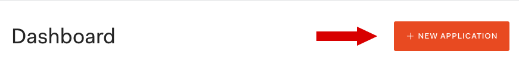
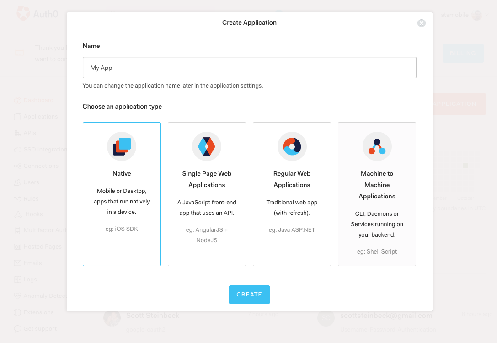
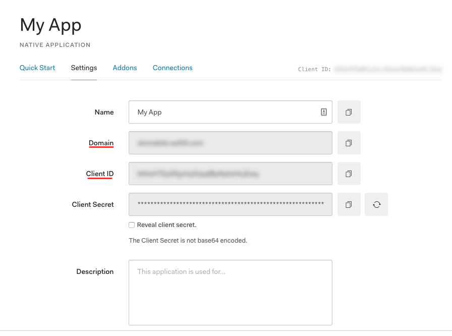
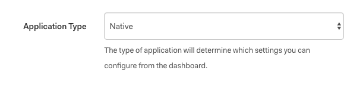
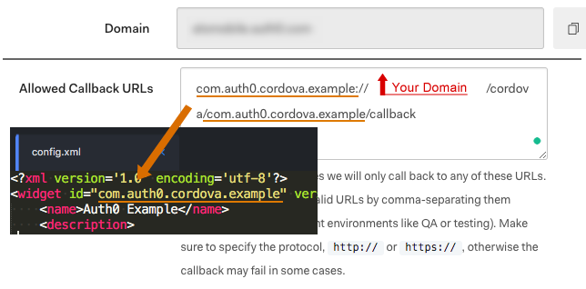
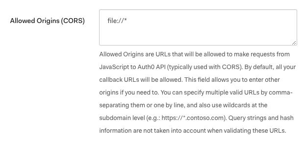
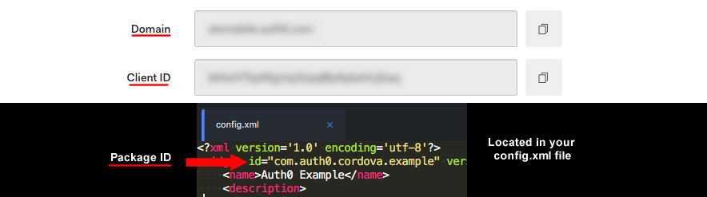

# Login

 <br>

This sample demonstrates how to add authentication to a Cordova application using [Auth0 Universal Login](https://auth0.com/docs/authenticate/login/auth0-universal-login).

This repo is supported and maintained by Community Developers, not Auth0. For more information about different support levels check https://auth0.com/docs/support/matrix .

## Getting started

If you haven't already done so, [sign up](https://auth0.com/signup) for your free Auth0 account.

## Auth0 API Setup

**1.** Create a **New Application** in the [dashboard](https://manage.auth0.com).





**2.** Find the **Domain** and **client ID** from the settings area.



**3.** Set the **Application Type** to native.



**4.** Set **Allowed Callback URLs**

## Callback URL

A Callback URL is a location in your app that users will be redirected to once authentication is complete. For Cordova applications, the format of the **Callback URL** is as such:

```bash
YOUR_PACKAGE_ID://YOUR_AUTH0_DOMAIN/cordova/YOUR_PACKAGE_ID/callback
```

- `YOUR_PACKAGE_ID` is the app identifier found in `config.xml`. Ex: `com.auth0.cordova.example`.
- `YOUR_AUTH0_DOMAIN` is your Auth0 tenant domain found in your client settings. Ex: `<tenant>.auth0.com`.



Be sure to add the appropriate **Callback URL** to the **Allowed Callback URLs** box in the client settings for your client in the Auth0 dashboard.

## CORS

**5.** Set up **Allowed Origins (CORS)**

## Set Environment Variables

```bash
file://*
```



## Installation

- **6.Install Cordova Plugins**

## Set Environment Variables



Rename the `env.js.example` file to `env.js` and provide the keys from above.

**env.js**

```bash
module.exports = {
  AUTH0_DOMAIN: '{DOMAIN}',
  AUTH0_CLIENT_ID: '{CLIENT_ID}',
  AUTH0_AUDIENCE: 'https://{DOMAIN}/userinfo',
  PACKAGE_ID: 'com.auth0.cordova.example'
};
```

> **Note:** If you have downloaded this sample from Auth0's Cordova tutorial, a file called `env.js` will come pre-populated with the **Client ID** and **Domain** for your client, as well as a default **Audience**.

## Set AndroidLaunchMode

In your `config.xml` file, add this preference:

```
<preference name="AndroidLaunchMode" value="singleTask" />
```

## Install the Dependencies and Run the App

This sample relies on several packages, including **auth0.js** and **auth0-cordova**. Install the dependencies with npm or yarn.

```bash
# installation with npm
npm install

# installation with yarn
yarn
```

The sample uses webpack. Run a command to instruct webpack to build the application bundle.

```bash
npm run build
```

Prepare Cordova for iOS and Android.

```bash
npm run prepare
```

Finally, emulate or run the application.

```bash
# emulate the app
cordova emulate ios

# run the app on a device
cordova run ios
```

> **Note:** The **auth0-cordova** package will only work when the app is being run in an emulator or on a real device. Errors will be encountered if trying to log in when testing in the browser.

## Contribute

Feel like contributing to this repo? We're glad to hear that! Before you start contributing please visit our [Contributing Guideline](https://github.com/auth0-community/getting-started/blob/master/CONTRIBUTION.md).

Here you can also find the [PR template](https://github.com/auth0-community/auth0-cordova-samples/blob/master/PULL_REQUEST_TEMPLATE.md) to fill once creating a PR. It will automatically appear once you open a pull request.

#### Development

Run the watcher to constantly build the application and pipe it to `/www` folder.

```bash
npm run watch
```

The JavaScript project is built from `src/index.js` to `/www/index.js`.

#### Before Shipping to Production

The Content Security Policy in the sample is configured using wildcards for ease of use. For example, the value for `connect-src` is `https://*.auth0.com`. This is fine for development and testing, but be sure to change this to be your Auth0 tenant domain before putting the application into production.

## Issues Reporting

Spotted a bug or any other kind of issue? We're just humans and we're always waiting for constructive feedback! Check our section on how to [report issues](https://github.com/auth0-community/getting-started/blob/master/CONTRIBUTION.md#issues)!

Here you can also find the [Issue template](https://github.com/auth0-community/auth0-cordova-samples/blob/master/ISSUE_TEMPLATE.md) to fill once opening a new issue. It will automatically appear once you create an issue.

## Repo Community

Feel like PRs and issues are not enough? Want to dive into further discussion about the tool? We created topics for each Auth0 Community repo so that you can join discussion on stack available on our repos. Here it is for this one: [auth0-cordova-samples](https://community.auth0.com/t/auth0-community-oss-auth0-cordova-samples/15989)

<a href="https://community.auth0.com/">

</a>

## License

This project is licensed under the MIT license. See the [LICENSE](https://github.com/auth0-community/auth0-cordova-samples/blob/master/LICENSE) file for more info.

## What is Auth0?

Auth0 helps you to:

- Add authentication with [multiple authentication sources](https://docs.auth0.com/identityproviders), either social like
- Google
- Facebook
- Microsoft
- Linkedin
- GitHub
- Twitter
- Box
- Salesforce
- etc.

**or** enterprise identity systems like:

- Windows Azure AD
- Google Apps
- Active Directory
- ADFS
- Any SAML Identity Provider

- Add authentication through more traditional [username/password databases](https://docs.auth0.com/mysql-connection-tutorial)
- Add support for [linking different user accounts](https://docs.auth0.com/link-accounts) with the same user
- Support for generating signed [JSON Web Tokens](https://docs.auth0.com/jwt) to call your APIs and create user identity flow securely
- Analytics of how, when and where users are logging in
- Pull data from other sources and add it to user profile, through [JavaScript rules](https://docs.auth0.com/rules)

## Create a free Auth0 account

- Go to [Auth0 website](https://auth0.com/signup)
- Hit the **SIGN UP** button in the upper-right corner
